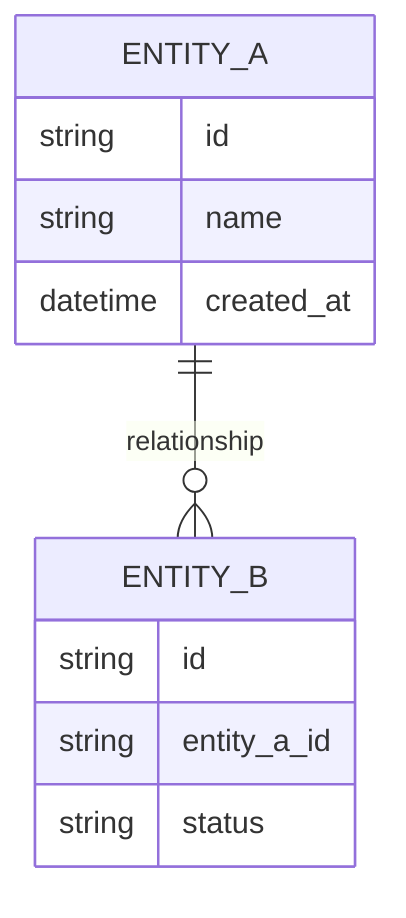
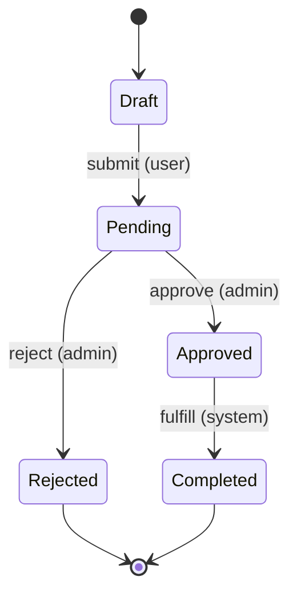

# [Domain Area Name]

## Purpose

One-paragraph summary of what this area does and why it exists.

## Key Entities

List the core entities, their key attributes, and relationships. Use a mermaid diagram if relationships are non-trivial.

## Business Rules & Invariants

Each rule follows this pattern:

- **Rule**: State the rule clearly.
- **Why**: Explain the business reason (this enables AI to reason correctly in adjacent code).
- **Enforced in**: Point to where in the codebase this is enforced (file, class, or function name).
- **Example**: A concrete scenario illustrating the rule, including at least one edge case.

---

- **Rule**: [Example] An order cannot be modified after it enters "shipped" status.
- **Why**: Downstream logistics systems snapshot the order at shipment time; modifications would cause fulfillment mismatches.
- **Enforced in**: `OrderStateMachine.validateTransition()` rejects edits on shipped orders.
- **Example**: A customer tries to change their shipping address 5 minutes after shipment. The system returns a 409 Conflict with instructions to contact support for a redirect request instead.

## Workflows & State Transitions

Describe key processes. Use mermaid state diagrams for anything with 3+ states. Specify who/what triggers each transition and what validations occur.

| Transition | Triggered by | Validations |
|---|---|---|
| Draft -> Pending | User submits | All required fields present, passes schema validation |
| Pending -> Approved | Admin approves | Admin has `approve` permission, item passes compliance check |
| Pending -> Rejected | Admin rejects | Rejection reason is required |
| Approved -> Completed | System fulfills | External service confirms fulfillment |

## Integration Points

External systems, APIs, webhooks, or other domain areas this module interacts with. Note any contracts or assumptions.

- **[System/API name]**: Brief description of the integration, what data flows in which direction, and any assumptions about availability or response format.

## Edge Cases & Known Gotchas

Non-obvious behaviors that have caused bugs or confusion before. These are extremely high-value for AI assistants.

- **[Gotcha title]**: Description of the non-obvious behavior, why it exists, and what to watch out for when modifying related code.
