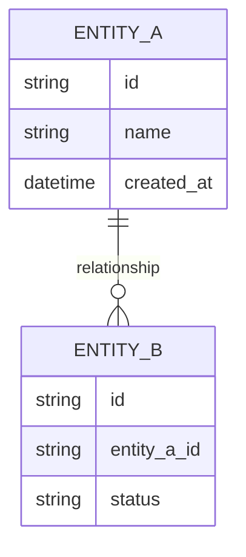
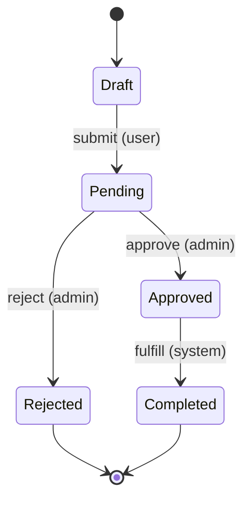

# [Domain Area Name]

## Table of Contents

- [Purpose](#purpose)
- [Key Entities](#key-entities)
- [Constraints](#constraints)
- [Business Rules & Invariants](#business-rules--invariants)
- [Workflows & State Transitions](#workflows--state-transitions)
- [Decision Trees](#decision-trees)
- [Integration Points](#integration-points)
- [Edge Cases & Known Gotchas](#edge-cases--known-gotchas)

## Purpose

One-paragraph summary of what this area does and why it exists.

## Key Entities

List the core entities, their key attributes, and relationships. Use a mermaid diagram if relationships are non-trivial.



## Constraints

The highest-value content — what MUST and MUST NOT happen in this domain area.

### MUST

- **Constraint**: State what must always be true.
  - **Why**: Business reason this constraint exists.
  - **Enforced in**: File, class, or function name.

### MUST NOT

- **Constraint**: State what must never happen.
  - **Why**: Business reason — what goes wrong if violated.
  - **Enforced in**: File, class, or function name.

## Business Rules & Invariants

Each rule follows this pattern:

- **Rule**: State the rule clearly.
- **Why**: Explain the business reason (this enables AI to reason correctly in adjacent code).
- **Enforced in**: Point to where in the codebase this is enforced (file, class, or function name). Leave empty or use `<!-- TODO: add code location after implementation -->` if not yet implemented.
- **Example**: A concrete scenario illustrating the rule, including at least one edge case.
- **Counterexample** *(critical rules)*: Show the wrong behavior and why it fails.
- **Source**: `[SOURCE: user-story]`, `[SOURCE: discussion]`, `[SOURCE: change-request]`, or `[SOURCE: code-audit — unconfirmed]`.

---

- **Rule**: [Example] An order cannot be modified after it enters "shipped" status.
- **Why**: Downstream logistics systems snapshot the order at shipment time; modifications would cause fulfillment mismatches.
- **Enforced in**: `OrderStateMachine.validateTransition()` rejects edits on shipped orders.
- **Example**: A customer tries to change their shipping address 5 minutes after shipment. The system returns a 409 Conflict with instructions to contact support for a redirect request instead.
- **Counterexample**: If the system allowed edits after shipment, the warehouse would ship to the old address while the customer sees the new one — causing a lost package and a support ticket.
- **Source**: `[SOURCE: user-story]`

## Workflows & State Transitions

Describe key processes. Use mermaid state diagrams for anything with 3+ states. Specify who/what triggers each transition and what validations occur.



| Transition | Triggered by | Validations |
|---|---|---|
| Draft -> Pending | User submits | All required fields present, passes schema validation |
| Pending -> Approved | Admin approves | Admin has `approve` permission, item passes compliance check |
| Pending -> Rejected | Admin rejects | Rejection reason is required |
| Approved -> Completed | System fulfills | External service confirms fulfillment |

## Decision Trees

Use sequential if-then format for multi-branch conditional logic. Mark mutually exclusive paths explicitly.

```
IF [condition A]
  THEN [action/outcome 1]
ELSE IF [condition B]           ← mutually exclusive with A
  IF [sub-condition B1]
    THEN [action/outcome 2]
  ELSE
    THEN [action/outcome 3]
ELSE                            ← default / fallback
  THEN [action/outcome 4]
```

## Integration Points

External systems, APIs, webhooks, or other domain areas this module interacts with. Note any contracts or assumptions.

- **[System/API name]**: Brief description of the integration, what data flows in which direction, and any assumptions about availability or response format.

## Edge Cases & Known Gotchas

Non-obvious behaviors that have caused bugs or confusion before. These are extremely high-value for AI assistants.

- **[Gotcha title]**: Description of the non-obvious behavior, why it exists, and what to watch out for when modifying related code.

<!--
Staleness markers — use these in comments to flag items for review:

<!-- TODO: clarify with team -->
<!-- TODO: add code location after implementation -->
<!-- STALE? last verified YYYY-MM-DD — needs review -->
-->
